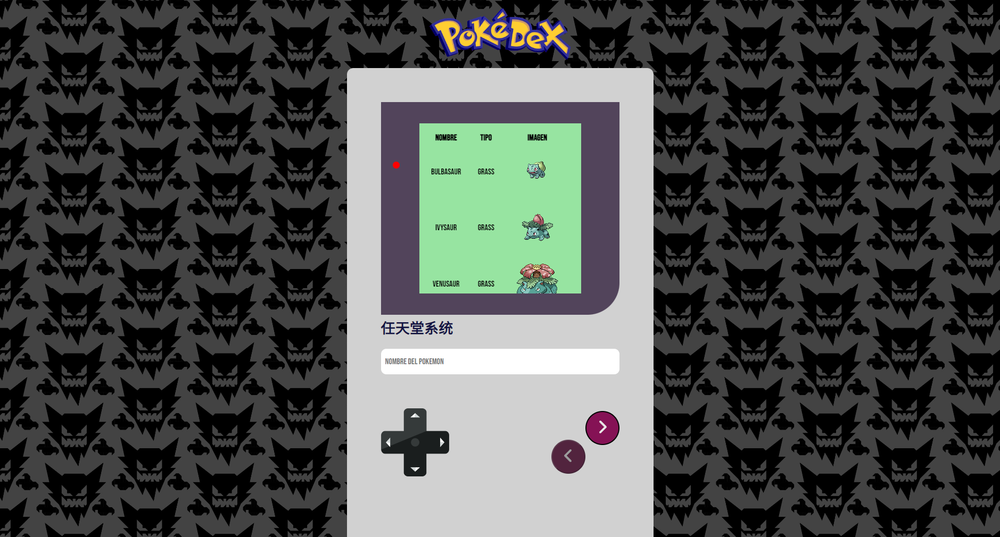

# Pokedex

App que hace uso de la [PokeAPI](https://pokeapi.co).

## Ejecución en local

A traves de Angular CLI con el comando `ng serve`. Como resultado, levantará la app en `http://localhost:4200/`.

